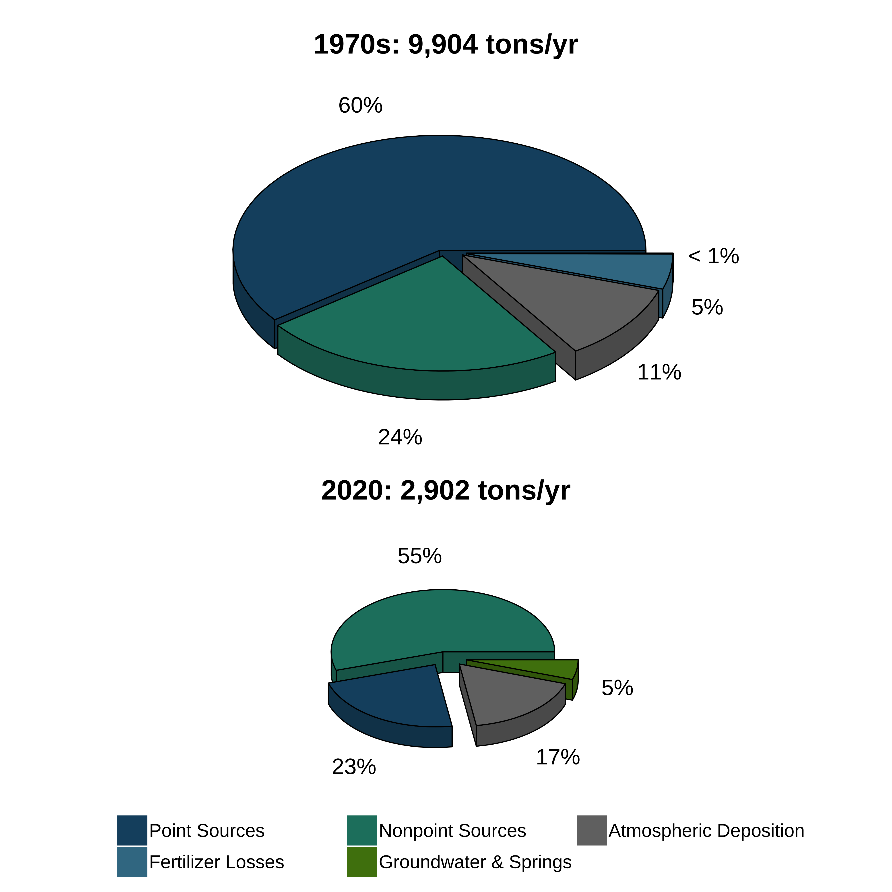

```{r setup, message = F, warning = F, results = 'hide', echo = FALSE}
knitr::opts_chunk$set(echo = TRUE, warning = F, message = F, echo = F, fig.path = 'figs/', fig.path = 'figures/')

library(tidyverse)
library(lubridate)
library(plotly)
library(colorspace)
library(reactable)
library(downloadthis)
library(tools)
library(shiny)
library(crosstalk)
library(DT)
library(scales)
library(plotrix)
library(here)
library(showtext)

data(tnanndat)
data(mosdat)
data(mosentdat)
data(totanndat)
data(npsmosdat)
data(npsdpsips)
data(npsdpsipsent)
data(npsmosludat)
data(mohydat)

source(here('R/funcs.R'))
source(here('R/figs.R'))

levs <- c('All Segments (- N. BCB)', 'Old Tampa Bay', 'Hillsborough Bay', 'Middle Tampa Bay', 'Lower Tampa Bay', 'Remainder Lower Tampa Bay')

# # style file
# styles <- readLines('https://raw.githubusercontent.com/tbep-tech/css-styling/master/styles.css')
# writeLines(styles, 'styles.css')
```

# {.tabset .tabset-fade .tabset-pills}

## Summary 

Total nitrogen load estimates to Tampa Bay for the 1970s and 2010s period by source: 

```{r}
column(12, 
  column(3, 
    download_file(
      path = here('figs/3dload_pies.png'),
      output_name = "TN-summary",
      output_extension = ".xlsx",
      button_label = "Download plot",
      button_type = "warning",
      has_icon = TRUE,
      icon = "fa fa-save"
      )
  )
)
```

<br><br>

```{r, out.width = '80%'}

```

<br>

Nitrogen inputs into Tampa Bay are a key limiting nutrient that can stimulate algal growth and negatively affect seagrass habitat.  The long-term recovery of Tampa Bay is attributed to the successful nitrogen reduction efforts of the Tampa Bay [Nitrogen Management Consortium](https://tbep.org/our-work/boards-committees/nitrogen-management-consortium/).  Nitrogen loads and sources are routinely estimated for Tampa Bay and reported to the Florida Department of Environmental Protection and US Environmental Protection Agency under a 5-year [Reasonable Assurance Plan](https://drive.google.com/file/d/10IjJAfcGFf007a5VdPXAUtUi4dx-cmsA/view).  

This dashboard provides a summary of nitrogen load estimates in various formats (all estimates from Janicki Environmental, Inc.). Load estimates are partitioned into one of five categories by source: 

* __AD__: atmospheric deposition
* __DPS__: domestic point source
* __GWS__: groundwater source
* __IPS__: industrial point source
* __NPS__: nonpoint source

Source estimates for total nitrogen are shown annually from 1985 to present, by month from 2017 to 2020 (current Reasonable Assurance period, also including total phosphorus, total suspended solids, and BOD), and by month from 2004 to 2020 for select sources (DPS reuse, DPS end of pipe, IPS, NPS).  The totals tab shows annual results for total nitrogen (TN), hydrologic load, and total nitrogen vs hydrologic load ratios. The load ratio plots show adopted numeric nutrient criteria for TN as horizontal lines that are applicable to each bay segment. 

Estimates are also assigned to individual bay segments recognized in the Tampa Bay [Reasonable Assurance Plan](https://drive.google.com/file/d/10IjJAfcGFf007a5VdPXAUtUi4dx-cmsA/view): Old Tampa Bay, Hillsborough Bay, Middle Tampa Bay, Lower Tampa Bay, and the Remainder of Lower Tampa Bay.  The "Remainder of Lower Tampa Bay" includes the Manatee River, Terra Ceia Bay, and southern Boca Ciega Bay.  Estimates for all segments are also provided as the sum of loads across the four major bay segments and the remainder of Lower Tampa Bay.  Note that this does not include the northern portion of Boca Ciega Bay (i.e., __(- N. BCB)__ in the tables and plots).  

Annual load targets for total nitrogen (tons/yr) by major bay segments are as follows ([2009 RA Addendum](https://drive.google.com/file/d/10IjJAfcGFf007a5VdPXAUtUi4dx-cmsA/view), shown on relevant annual load plots):

* Old Tampa Bay: 486 tons/yr
* Hillsborough Bay: 1451 tons/yr
* Middle Tampa Bay: 799 tons/yr
* Lower Tampa Bay:  349 tons/yr
* Remainder of Lower Tampa Bay: 629 tons/yr

Hydrologically-normalized load targets, as a ratio of total nitrogen to hydrologic load (nitrogen delivery ratios) for each bay segment, are also shown on relevant plots ([2009 RA Addendum](https://drive.google.com/file/d/10IjJAfcGFf007a5VdPXAUtUi4dx-cmsA/view)). These nitrogen delivery ratios have been adopted as the annual RA compliance assessment thresholds and/or [estuarine numeric nutrient criteria](https://www.flrules.org/gateway/RuleNo.asp?title=SURFACE%20WATER%20QUALITY%20STANDARDS&ID=62-302.532) for Tampa Bay and are as follows :

* Old Tampa Bay: 1.08 tons/million cubic meters  of water
* Hillsborough Bay: 1.62 tons/million cubic meters  of water
* Middle Tampa Bay: 1.24 tons/million cubic meters  of water
* Lower Tampa Bay:  0.97 tons/million cubic meters  of water
* Remainder of Lower Tampa Bay: 1.59 tons/million cubic meters  of water
+ Boca Ciega Bay South: 0.97 tons/million cubic meters  of water
+ Terra Ceia Bay: 1.10 tons/million cubic meters  of water
+ Manatee River Estuary: 1.80 tons/million cubic meters  of water
* Boca Ciega Bay North: 1.54 tons/million cubic meters  of water

```{r, out.width = '40%', fig.align = 'center', fig.cap='Major bay segments in Tampa Bay used to assign load estimates.  The "Remainder of Lower Tampa Bay" includes the Manatee River, Terra Ceia Bay, and Boca Ciega Bay. Figure courtesy of Janicki Environmental, Inc.'}
knitr::include_graphics('figs/segmap.PNG')
```

## Total nitrogen (annual, 1985 - 2020) {.tabset}

```{r}
column(12, 
  column(3, 
    tnanndat %>%
      download_this(
        output_name = "TN-annual",
        output_extension = ".xlsx",
        button_label = "Download plot data",
        button_type = "warning",
        has_icon = TRUE,
        icon = "fa fa-save"
      )
  )
)
```

<br></br>
<br></br>

### By source

Dotted line is annual bay segment target. 

```{r, out.width = '100%', out.height='1000px'}
tnsrc_plo(tnanndat, xval = 'year', src = 'all', addtnlns = T)
```

### Table

```{r}
rct_tab(tnanndat, dtvar = 'year', typ = 'tn')
```

### Metadata

Data from the __Download plot data__ button includes the following: 

* __*year*__: year of the estimate
* __*bay_segment*__: the bay segment for the source/year estimate, one of Old Tampa Bay, Hillsborough Bay, Middle Tampa Bay, Lower Tampa Bay, Remainder of Lower Tampa Bay (Manatee River, Terra Ceia Bay, and Boca Ciega Bay South), and all segments as the sum of all (excluding Boca Ciega Bay North)
* __*source*__: total nitrogen source as atmospheric deposition (AD), domestic point source (DPS), groundwater source (GWS), industrial point source (IPS), and non-point source (NPS)
* __*tn_load*__: total nitrogen load in tons / year

## Total nitrogen, phosphorus, suspended solids, and BOD by source (monthly, 2017 - 2020) {.tabset}

```{r}
column(12,
  column(3, 
    mosdat %>%
      download_this(
        output_name = "monthly",
        output_extension = ".xlsx",
        button_label = "Download all plot data",
        button_type = "warning",
        has_icon = TRUE,
        icon = "fa fa-save"
      )
    ), 
  column(3,
    mosentdat %>%
      download_this(
        output_name = "entity-monthly",
        output_extension = ".xlsx",
        button_label = "Download all entity data",
        button_type = "warning",
        has_icon = TRUE,
        icon = "fa fa-save"
      )
    )     
)
```

<br></br>
<br></br>

### Total nitrogen by source

```{r, out.width = '100%', out.height='1000px'}
tnsrc_plo(mosdat, xval = 'date', src = 'all', yval = 'tn_load')
```

### Total nitrogen table

```{r}
rct_tab(mosdat, dtvar = 'date', typ = 'tn', val = 'tn_load')
```

### Total phosphorus by source

```{r, out.width = '100%', out.height='1000px'}
tnsrc_plo(mosdat, xval = 'date', src = 'all', yval = 'tp_load')
```

### Total phosphorus table

```{r}
rct_tab(mosdat, dtvar = 'date', typ = 'tn', val = 'tp_load')
```

### Total suspended solids by source

```{r, out.width = '100%', out.height='1000px'}
tnsrc_plo(mosdat, xval = 'date', src = 'all', yval = 'tss_load')
```

### Total suspended solids table

```{r}
rct_tab(mosdat, dtvar = 'date', typ = 'tn', val = 'tss_load')
```

### BOD by source

```{r, out.width = '100%', out.height='1000px'}
tnsrc_plo(mosdat, xval = 'date', src = 'all', yval = 'bod_load')
```

### BOD table

```{r}
rct_tab(mosdat, dtvar = 'date', typ = 'tn', val = 'bod_load')
```

### Metadata

Data from the __Download all plot data__ button includes the following: 

* __*year*__: year of the estimate
* __*month*__: month of the estimate
* __*bay_segment*__: the bay segment for the source/year estimate, one of Old Tampa Bay, Hillsborough Bay, Middle Tampa Bay, Lower Tampa Bay, Remainder of Lower Tampa Bay (Manatee River, Terra Ceia Bay, and Boca Ciega Bay South), and all segments as the sum of all (excluding Boca Ciega Bay North)
* __*source*__: total nitrogen source as atmospheric deposition (AD), domestic point source (DPS), groundwater source (GWS), industrial point source (IPS), and non-point source (NPS)
* __*tn_load*__: total nitrogen load in tons / month
* __*tp_load*__: total phosphorus load in tons / month
* __*tss_load*__: total suspended solids load in tons / month
* __*bod_load*__: biological oxygen demand in tons / month

Data from the __Download all entity data__ button includes the following: 

* __*year*__: year of the estimate
* __*month*__: month of the estimate
* __*entity*__: entity responsible for the load, e.g., a specific wastewater treatment plant
* __*source*__: total nitrogen source as atmospheric deposition (AD), domestic point source (DPS), groundwater source (GWS), industrial point source (IPS), and non-point source (NPS)
* __*tn_load*__: total nitrogen load in tons / month
* __*tp_load*__: total phosphorus load in tons / month
* __*tss_load*__: total suspended solids load in tons / month
* __*bod_load*__: biological oxygen demand in tons / month

## Total hydrologic load (monthly, 2017 - 2020) {.tabset}

```{r}
column(12,
  column(3, 
    mohydat %>%
      download_this(
        output_name = "monthly-hydrology",
        output_extension = ".xlsx",
        button_label = "Download all plot data",
        button_type = "warning",
        has_icon = TRUE,
        icon = "fa fa-save"
      )
    )     
)
```

<br></br>
<br></br>

### Plot

```{r, out.width = '100%', out.height='1000px'}
hy_plo(mohydat)
```

### Table

```{r}
hy_tab(mohydat)
```

### Metadata

Data from the __Download all plot data__ button includes the following: 

* __*year*__: year of the estimate
* __*month*__: month of the estimate
* __*bay_segment*__: the bay segment for the month estimate, one of Old Tampa Bay, Hillsborough Bay, Middle Tampa Bay, Lower Tampa Bay, Remainder of Lower Tampa Bay (Manatee River, Terra Ceia Bay, and Boca Ciega Bay South), and all segments as the sum of all (excluding Boca Ciega Bay North)
* __*hy_load_106_m3_mo*__: hydrologic load as 10$^6$ m$^3$/month

## Total nitrogen select sources (monthly, 2004 - 2020) {.tabset}

```{r}
column(12, 
  column(3, 
    npsdpsips %>%
      download_this(
        output_name = "TN-select-sources-monthly",
        output_extension = ".xlsx",
        button_label = "Download plot data",
        button_type = "warning",
        has_icon = TRUE,
        icon = "fa fa-save"
      )
  ),
  column(3,
    npsdpsipsent %>%
      download_this(
        output_name = "TN-entity-monthly",
        output_extension = ".xlsx",
        button_label = "Download entity data",
        button_type = "warning",
        has_icon = TRUE,
        icon = "fa fa-save"
      )
  ),
  column(3,
    npsmosludat %>%
      download_this(
        output_name = "TN-lu-monthly",
        output_extension = ".xlsx",
        button_label = "Download NPS by land use",
        button_type = "warning",
        has_icon = TRUE,
        icon = "fa fa-save"
      )
  ) 
)
```

<br></br>
<br></br>

### By source

```{r, out.width = '100%', out.height='1000px'}
tnsrc_plo(npsdpsips, xval = 'date', src = 'select')
```

### Table

```{r}
rct_tab(npsdpsips, dtvar = 'date', typ = 'tn')
```

### NPS by land use

```{r, out.width = '100%', out.height = '250px'}
dat <- npsmosdat %>% 
  group_by(year, bay_segment, month, lu) %>% 
  summarise(tn_load = sum(tn_load, na.rm = T), .groups = 'drop') %>% 
  mutate(dy = 1) %>% 
  unite('date', year, month, dy, sep = '-') %>% 
  mutate(
    date = ymd(date), 
    tn_load = round(tn_load, 1)
    ) %>% 
  spread(bay_segment, tn_load, fill = 0) %>% 
  select(date, lu, `Old Tampa Bay`, `Hillsborough Bay`, `Middle Tampa Bay`, `Lower Tampa Bay`, `Remainder Lower Tampa Bay`)

toplo <- highlight_key(dat)
filter_select("filter", "Select land use", toplo, ~lu, multiple = F)

showleg <- F
cols <- qualitative_hcl(5, palette = "Dynamic")
plot_ly(toplo, alpha = 1, fill = 'tonexty') %>%
  add_markers(x = ~date, y = ~`Remainder Lower Tampa Bay`, color = I(cols[1]), stackgroup = 'one', mode = 'none', marker = list(opacity = 0, size = 0), showlegend = T, legendgroup = 'grp1', name = 'Remainder Lower Tampa Bay') %>% 
  add_markers(x = ~date, y = ~`Lower Tampa Bay`, color = I(cols[2]), stackgroup = 'one', mode = 'none', marker = list(opacity = 0, size = 0), showlegend = T, legendgroup = 'grp2', name = 'Lower Tampa Bay') %>%
  add_markers(x = ~date, y = ~`Middle Tampa Bay`, color = I(cols[3]), stackgroup = 'one', mode = 'none', marker = list(opacity = 0, size = 0), showlegend = T, legendgroup = 'grp3', name = 'Middle Tampa Bay') %>%
  add_markers(x = ~date, y = ~`Hillsborough Bay`, color = I(cols[4]), stackgroup = 'one', mode = 'none', marker = list(opacity = 0, size = 0), showlegend = T, legendgroup = 'grp4', name = 'Hillsborough Bay') %>%
    add_markers(x = ~date, y = ~`Old Tampa Bay`, color = I(cols[5]), stackgroup = 'one', mode = 'none', marker = list(opacity = 0, size = 0), showlegend = T, legendgroup = 'grp5', name = 'Old Tampa Bay') %>% 
  
  layout(
    xaxis = list(title = NA, gridcolor = '#FFFFFF'),
    yaxis = list(title = 'TN load (tons / mo)', gridcolor = '#FFFFFF'),
    barmode = 'stack',
    legend = list(title = list(text = 'Bay segment'), traceorder = 'reversed')
  ) %>% 
  config(
    toImageButtonOptions = list(
      format = "svg",
      filename = "myplot"
    )
  )

datatable(toplo, extensions="Scroller", style="bootstrap", class="compact", width="100%",
    options=list(deferRender=TRUE, scrollY=300, scroller=TRUE, 
                 columnDefs = list(list(visible = F, targets = 2)), 
                  headerCallback = DT::JS(
    "function(thead) {",
    "  $(thead).css('font-size', '0.8em');",
    "}"
  )), 
    colnames = c('Date', 'Land use', 'Old Tampa Bay', 'Hillsborough Bay', 'Middle Tampa Bay', 'Lower Tampa Bay', 'Remainder Lower Tampa Bay')) %>% 
  formatStyle(columns = 1:7, fontSize = '80%')
  
```

```{js}
function filter_default() {
    document.getElementById("filter").getElementsByClassName("selectized")[0].selectize.setValue("High Density Residential", false);
}
window.onload = filter_default;
```

### Metadata

Data from the __Download plot data__ button includes the following: 

* __*year*__: year of the estimate
* __*month*__: month of the estimate
* __*bay_segment*__: the bay segment for the source/year estimate, one of Old Tampa Bay, Hillsborough Bay, Middle Tampa Bay, Lower Tampa Bay, Remainder of Lower Tampa Bay (Manatee River, Terra Ceia Bay, and Boca Ciega Bay South), and all segments as the sum of all (excluding Boca Ciega Bay North)
* __*source*__: total nitrogen source as domestic point source reuse (DPS - reuse), domestic point source end of pipe (DPS - end of pipe), industrial point source (IPS), and non-point source (NPS)
* __*tn_load*__: total nitrogen load in tons / month

Data from the __Download entity data__ button includes the following: 

* __*year*__: year of the estimate
* __*month*__: month of the estimate
* __*entity*__: entity responsible for the load, e.g., a specific wastewater treatment plant
* __*source*__: total nitrogen source as atmospheric deposition (AD), domestic point source (DPS), groundwater source (GWS), industrial point source (IPS), and non-point source (NPS)
* __*tn_load*__: total nitrogen load in tons / month

Data from the __Download NPS by land use__ button includes the following: 

* __*year*__: year of the estimate
* __*month*__: month of the estimate
* __*bay_segment*__: the bay segment for the source/year estimate, one of Old Tampa Bay, Hillsborough Bay, Middle Tampa Bay, Lower Tampa Bay, Remainder of Lower Tampa Bay (Manatee River, Terra Ceia Bay, and Boca Ciega Bay South), and all segments as the sum of all (excluding Boca Ciega Bay North)
* __*land use*__: land use type associated with the load
* __*source*__: total nitrogen source as non-point source (NPS)
* __*tn_load*__: total nitrogen load in tons / month

## Totals {.tabset}

```{r}
column(12, 
  column(3,
    totanndat %>%
      download_this(
        output_name = "hydro-annual",
        output_extension = ".xlsx",
        button_label = "Download plot data",
        button_type = "warning",
        has_icon = TRUE,
        icon = "fa fa-save"
      )
  )
)
```

<br></br>
<br></br>

### Total Nitrogen

Dotted line is annual bay segment target. 

```{r, out.width = '100%', out.height='1000px'}
ldtot_plo(totanndat, yval = 'tn_load', addtnlns = T)
```

### Hydrology

Dotted line is annual bay segment target. 

```{r, out.width = '100%', out.height='1000px'}
ldtot_plo(totanndat, yval = 'hy_load')
```

### Total Nitrogen vs Hydrology

Dotted line is annual bay segment target. 

```{r, out.width = '100%', out.height='1000px'}
ldtot_plo(totanndat, yval = 'tnhy', addlns = T)
```

### Table 

```{r}
rct_tab(totanndat, dtvar = 'year', typ = 'tots')
```

### Metadata

Data from the __Download plot data__ button includes the following: 

* __*year*__: year of the estimate
* __*bay_segment*__: the bay segment for the source/year estimate, one of Old Tampa Bay, Hillsborough Bay, Middle Tampa Bay, Lower Tampa Bay, Remainder of Lower Tampa Bay (Manatee River, Terra Ceia Bay, and Boca Ciega Bay South), and all segments as the sum of all (excluding Boca Ciega Bay North)
* __*tn_load*__: total nitrogen load in tons / year
* __*hy_load*__: hydrologic load in million cubic meters / year
* __*tnhy*__: ratio between total nitrogen and hydrologic loads

<script type="text/javascript" src="js/iframeResizer.contentWindow.min.js"></script>
